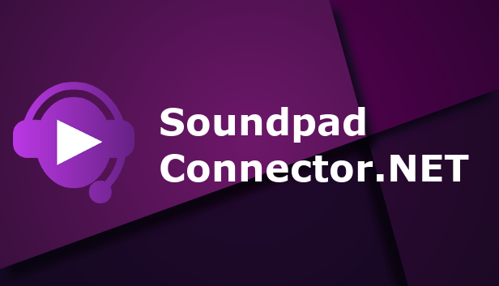

<h1 align="center">
   
</h1>

<p align="center">
    SoundpadConnector provides an .NET API to programmatically interact with a local <a href="https://store.steampowered.com/app/629520/Soundpad/">Soundpad</a> instance.
</p>

## Table of contents

  * [Installation](#installation)
  * [QuickStart](#quickstart)
  * [Documentation](#documentation)
  * [Examples](#examples)
  * [Limitations](#limitations)
  * [Contributing](#contributing)
  * [License](#license)
  * [Special thanks](#special-thanks)

## Installation
Get the NuGet package from [https://www.nuget.org/packages/SoundpadConnector](https://www.nuget.org/packages/SoundpadConnector) or install via NuGet console:
```bash
Install-Package SoundpadConnector
```

## QuickStart
```csharp
using System;
using SoundpadConnector;

namespace Examples {
    class Program {
        public static Soundpad Soundpad;

        static void Main(string[] args)
        {
            Soundpad = new Soundpad();
            Soundpad.StatusChanged += SoundpadOnStatusChanged;

            // Note that the API is asynchronous. Make sure that Soundpad is connected before executing commands.
            Soundpad.ConnectAsync();

            Console.ReadLine();

        }

        private static void SoundpadOnStatusChanged(object sender, EventArgs e)
        {
            Console.WriteLine(Soundpad.ConnectionStatus);

            if (Soundpad.ConnectionStatus == ConnectionStatus.Connected)
            {
                Soundpad.PlaySound(1);              
            }
        }
    }
}

```

## Documentation
Read the [Docs](https://medokin.github.io/soundpad-connector/api/index.html) (WIP!)

## Examples
Browse the [Examples](examples).

## Limitations
SoundpadConnector does **not work** with Soundpad's **Demo** version.

## Contributing
You may contribute in several ways like creating new features, fixing bugs, improving documentation and examples
or translating any document here to your language. Read our [Code of Conduct](CODE_OF_CONDUCT.md).

## License
[MIT](LICENSE) - Nikodem Jaworski - 2018

## Special thanks
* [Leppsoft](https://leppsoft.com/soundpad/de/) - The Company behind Soundpad
